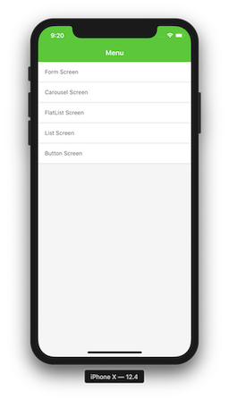

# AppDriver Native Demo App

Contains sample screens to demonstrate common scenarios.

## Screenshots




## Steps To Create

Install React Native template
```
npx react-native-cli init NativeDemoApp --version 0.61.2
```

Install React Navigation dependencies
```
yarn add \
  react-navigation@4.0.10 \
  react-native-gesture-handler@1.4.1 \
  react-native-reanimated@1.3.0 \
  react-native-screens@1.0.0-alpha.23 \
  react-navigation-stack@1.9.4
```

Configure Android `app/build.gradle` for Navigation. Add the following to the `dependencies` section.
```
implementation 'androidx.appcompat:appcompat:1.1.0-rc01'
implementation 'androidx.swiperefreshlayout:swiperefreshlayout:1.1.0-alpha02'
```

Configure Android `MainActivity.java` for Navigation. Add the following to the imports and the class respectively:
```
import com.facebook.react.ReactActivityDelegate;
import com.facebook.react.ReactRootView;
import com.swmansion.gesturehandler.react.RNGestureHandlerEnabledRootView;
```

```
@Override
protected ReactActivityDelegate createReactActivityDelegate() {
  return new ReactActivityDelegate(this, getMainComponentName()) {
    @Override
    protected ReactRootView createRootView() {
      return new RNGestureHandlerEnabledRootView(MainActivity.this);
    }
  };
}
```

Install Slider dependency (now it has been exacted from RN core)
```
yarn add @react-native-community/slider@2.0.2
```

Update metro.config.js to enable .jsx file extension
```
resolver: {
  sourceExts: ["jsx", "js", "json"]
}
```

To finish, replace template files with source code (be sure to replace index.js and remove App.js).
